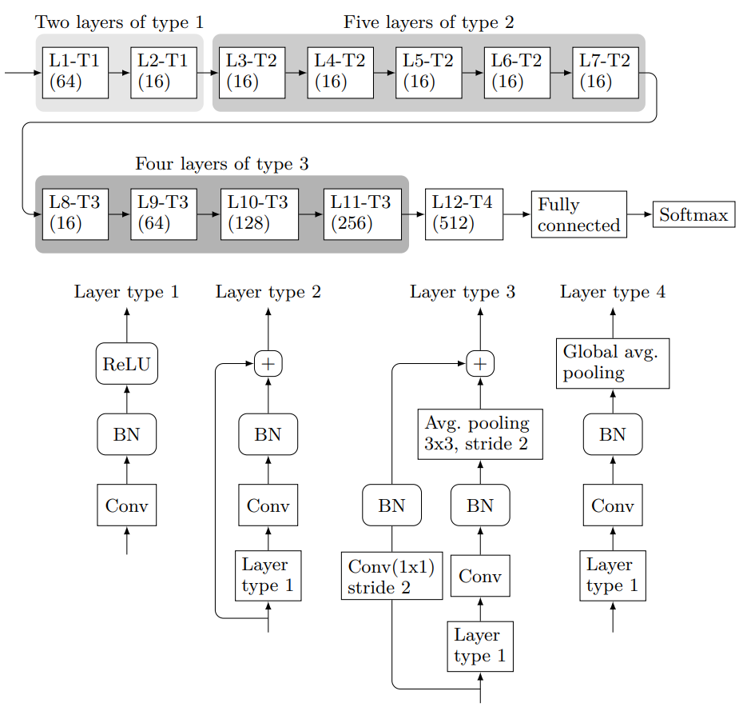

# SRNet Deep Learning steganalyzer Tensorflow implementation

## Summary

This repository contains a Tensorflow 2.0 implementation of SRNet, a Deep Learning steganalyzer presented by [Mehdi Boroumand et al.](https://ieeexplore.ieee.org/document/8470101) The main goal of SRNet is to obtain good results by distinguishing between images with hidden information inside and those without hidden information without using any kind of domain information, such as initialising the weights of the first layers with high-pass filters. One architecture that does use this initialisation of the initial layers is YeNet, presented in [Jian Ye et al.](https://ieeexplore.ieee.org/document/7937836)

The SRNet accuracy reported in its paper is **89.77\%**, but with the code shown in this repository only an accuracy close to **83\%** has been attained. This may be due to the dataset creation randomness, the framework used to code the architecture or even any little mistake in the code. In the [Pytorch-implementation-of-SRNet](https://github.com/brijeshiitg/Pytorch-implementation-of-SRNet) repository a Pytorch version of SRNet can be seen that reaches an accuracy of **89.43\%**.

The SRNet architecture can be seen in the following figure.

  

There are a bunch of different files and folders in the repository:

- `dataset/` This folder is thought to be the one that contains the different used datasets. It also contains the `SRNet_dataset_creation.ipynb` notebook whose objective is to generate a dataset similar to the one described in [Mehdi Boroumand et al.](https://ieeexplore.ieee.org/document/8470101) after the stego images have been created.
- `trained_models/` This folder contains the output files created by the `SRNet_training.ipynb` notebook. It also has the `SRNet-PairedBatches-2` model as an example of the output files.
- `SRNet_model.py` It contains the SRNet architecture coded in Tensorflow 2.0.
- `SRNet_training.ipynb` Notebook to train SRNet once the dataset is created. This notebook creates some files that are stored in the `trained_models/` folder.
- `paired_image_generator.py` This file contains a custom image generator that generates paired batches. This is, if we have a 16 images batch, 8 of them are cover images and the remaining 8 images are their respective stego versions. This is fundamental for the correct convergence of the model.

## Instructions

In this section, some instructions are given to train a model from scratch using the different files given in the repository.

1. [BOSS](http://agents.fel.cvut.cz/boss/) and [BOWS](http://bows2.ec-lille.fr/) datasets have to be downloaded. These are the two datasets used in [Mehdi Boroumand et al.](https://ieeexplore.ieee.org/document/8470101)
2. Generate the stego version of all the images downloaded in the previous step. This can be performed by using the different steganographic algorithm implementations that can be found in the [Binghamton University website](http://dde.binghamton.edu/download/stego_algorithms/).
3. Once the stego versions are generated, we should have four different folders; BOSS cover and stego images and BOWS cover and stego images. Execute the `dataset/SRNet_dataset_creation.ipynb` notebook to finally generate the dataset that will be used in the training phase.
4. Configure the different variables of the `SRNet_training.ipynb` notebook and execute it.

## Author
David González González <a href="https://www.linkedin.com/in/david-gonzalez-gonzalez/">LinkedIn</a>
